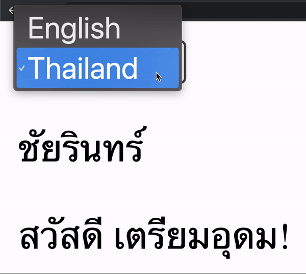

# ANGULAR TRANSLATE MULTIPLE LANGUAGE

1.  `git clone https://github.com/chaiyarin/i18n-angular-example.git`
2.  `npm install`
3.  โดยใน angular นี้ ได้ติดตั้ง package 2 package สำหรับการแปลภาษา
    - npm install @ngx-translate/core --save
    - npm install @ngx-translate/http-loader --save
4.  วิธีการ Setup ให้ไปที่ File : app.module.ts และ Setup ตาม Source Code ด้านล่าง

```typescript
import { NgModule } from "@angular/core";
import { BrowserModule } from "@angular/platform-browser";
import { HttpClientModule, HttpClient } from "@angular/common/http";
import { AppRoutingModule } from "./app-routing.module";
import { AppComponent } from "./app.component";
import { TranslateLoader, TranslateModule } from "@ngx-translate/core";
import { TranslateHttpLoader } from "@ngx-translate/http-loader";

export function HttpLoaderFactory(http: HttpClient) {
  return new TranslateHttpLoader(http);
}
@NgModule({
  declarations: [AppComponent],
  imports: [
    BrowserModule,
    AppRoutingModule,
    HttpClientModule,
    TranslateModule.forRoot({
      loader: {
        provide: TranslateLoader,
        useFactory: HttpLoaderFactory,
        deps: [HttpClient],
      },
    }),
  ],
  providers: [],
  bootstrap: [AppComponent],
})
export class AppModule {}
```

5.  สร้าง Folder ชื่อ i18n ภายใน Folder: assets
6.  สร้างไฟล์ชื่อ en.json แล้วใส่เนื้อหาตามตัวอย่างด้านล่าง

```json
{
  "FIRSTNAME": "Chaiyarin",
  "LASTNAME": "Niamsuwan",
  "HELLO_TITLE_PARAM": "Hello {{school}}!"
}
```

7.  สร้างไฟล์ชื่อ th.json แล้วใส่เนื้อหาตามตัวอย่างด้านล่าง

```json
{
  "FIRSTNAME": "ชัยรินทร์",
  "LASTNAME": "เนียมสุวรรณ",
  "HELLO_TITLE_PARAM": "สวัสดี {{school}}!"
}
```

8.  ไปที่ Component ที่เราต้องการจะ Display ภาษา ณ ที่นี้คือ `app.component.html` ใช้ | (pipe) ในการเรียก Lib เพื่อ Translate

```html
<select (change)="switchLanguage($event)">
  <option value="en">English</option>
  <option value="th">Thailand</option>
</select>

<p>{{ 'FIRSTNAME' | translate }}</p>
<p>{{ 'HELLO_TITLE_PARAM' | translate:{school: 'เตรียมอุดม'} }}</p>
```

9.  ไปสร้าง Function สำหรับเปลี่ยนภาษา ชื่อเดียวกันกับใน `app.component.html` ชื่อว่า `switchLanguage($event)` ที่ไฟล์ `app.component.ts`

```typescript
import { Component } from "@angular/core";
import { TranslateService } from "@ngx-translate/core";

@Component({
  selector: "app-root",
  templateUrl: "./app.component.html",
  styleUrls: ["./app.component.css"],
})
export class AppComponent {
  title = "POC_I18N_TRANSLATE";

  constructor(private translate: TranslateService) {
    translate.setDefaultLang("en");
  }

  switchLanguage(event: Event) {
    const target = event.target as HTMLInputElement;
    const value = target.value;
    this.translate.use(value);
  }
}
```

10. Start Angular Project ด้วยคำสั่ง `ng server` เป็นอันจบพิธี


